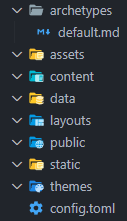

<h6 style="text-align: center;">
Abgabe für M+I-271 / M+I-272: Medientechnik Print/Web<br>
David Bühler mgp4 190035
</h6>

#### Kurzübersicht:
1. [Der Drang zur eigenen Website](#der-drang-zur-eigenen-website)
2. [Anforderungen](#anforderungen)
3. [Die Suche nach dem richtigen CMS](#die-suche-nach-dem-richtigen-cms)
4. [Zugriffskontrolle über Github](#zugriffskontrolle-über-github)
5. [Continuous Integration und Gratis-Hosting](#continuous-integration-und-gratis-hosting)
6. [Einrichtung](#einrichtung)
7. [Arbeiten mit dem CMS](#arbeiten-mit-dem-cms)
8. [Medieneinbindung](#medieneinbindung)
9. [Dynamik trotz statischer Website](#dynamik-trotz-statischer-website)
10. [Responsive Design](#responsive-design)
11. [Fazit](#fazit)

### Der Drang zur eigenen Website
Heutzutage ist es ein Muss eine eigene Web Präsenz zu haben. Zumindest heißt es das ständig in zahlreichen Sponsorsegmenten auf YouTube oder anderen Social-Media-Plattformen, in welchen von simplen Website-Baukästen geschwärmt wird, mit denen man aus vorgefertigten Bausteinen seine eigene Website zusammenklicken kann. Und das nur für ein *paar* Euro im Monat!

Doch auch wenn wir noch lange nicht an diesem Punkt angelangt sind, so ist sie für viele notwendig um ihre Fähigkeiten, Podukte oder Dienstleistungen zu präsentieren und damit zu werben. Und so ähnlich war das auch bei mir. In diesem Artikel möchte ich daher meine Erfahrungen und Vorgehensweisen teilen, die ich beim Aufbau dieser Website erlernt habe.

### Anforderungen
Jeder benutzt seine Website anderst. Manche wollen nur eine Visitenkarte von sich im Internet, andere wollen ihr Porfolio präsentieren und wiederum andere denken sie könnten die nächste große Social-Media-Plattform über Wordpress aufbauen.

Wie dem auch sei, das Hauptziel meiner Website war es jedenfalls, eine Plattform zu haben, auf der ich einen Blog führen und meine Projekte archivieren kann. Das Design sollte modern, minimalistisch und einladend wirken und auf allen Geräten gleich aussehen.

Da ich mich aber auch gerne mit der Technik dahinter auseinandersetzen wollte, hatte ich folgende technische Anforderungen an meine Website:
- **Content muss in Plain-Text-Dateien geschrieben werden können.**
- **Multilingual Support.**
- **Einfache Einbindung von Inhalten.**
- **Artikel mit Kategorien und Tags mit Suchfunktion**
- **Versionsverlauf**
- **Automatische Veröffentlichung neuer Artikel**
- **Eigene Kontrolle über Hosting und Domain**
- **Kein Backend-Server**

### Die Suche nach dem richtigen CMS
Wer selbst schon mal nach Content-Management-Systemen zum Aufsetzen einer eigenen Website recherchiert hat, wird schnell festgestellt haben, dass die meisten Angebote auf dynamischen Websites basieren. Dies bedeutet, dass die Inhalte der Website erst beim Aufrufen der Seite von einem Server aus Datenbanken geladen und dann dynamisch generiert werden.

Dies ist zwar in manchen Anwendungsfällen ganz toll, allerdings aber auch teuer. Denn um eine dynamische Website zu betreiben muss jederzeit im Hintergrund ein Server laufen, der die Datenbanken verwaltet und die Seiten generiert. Diesen kann man entweder selbst betreiben, was mit zusätzlichen Kosten für Hardware und Strom verbunden ist, oder über einen Provider welcher für einen monatlichen Betrag die Server bereitstellt.

Die Alternative dazu sind statische Websites. Wie auch schon bei den ersten Websites, sind hier bereits alle Inhalte in HTML-Dateien vorbereitet und müssen nur noch ausgeliefert werden. Dies ist nicht nur kostengünstiger, sondern auch schneller und simpler. Doch dieses System kommt mit einem anderen Nachteil. Anderst wie früher hat nämlich heutzutage niemand mehr Lust, HTML-Dateinen von Hand zu schreiben. Stattdessen gibt es hierfür Static-Site-Generatoren, welche den Content in seiner Rohform in fertige HTML-Websites rendern. 


<a href="https://gohugo.io/">
    <figure style="display: block; width: 50%; margin-left: auto; margin-right: auto;">
        
    </figure>
</a>


Einer dieser Generatoren ist [Hugo](https://gohugo.io/), welcher mich mit seiner Einfachkeit und Geschwindigkeit überzeugt hat. Mit ihm werden Artikel in **Markdown-Dateien** (.txt-Dateinen mit Rich-Text-Formatierung) geschrieben und dann von HUGO in HTML-Templates eingespeißt. Hierfür wird auch keine Datenbank benötigt, da das Layout der Seite durch die Ordnerstruktur definiert wird.


### Zugriffskontrolle über Github
Wem bei der Vorstellung, einen Ordner mit Dateien, statt einer Datenbank zu verwenden, übel wird, den kann ich beruhigen, denn ich werde nicht einfach meinen Website-Content auf einem FTP-Server ablegen und die Autoren (wenn ich welche hätte) bitten ihre Änderungen doch zu dokumentieren.

Stattdessen wird der Content in einem **Git-Repository verwaltet**. Git ist ein [Versionskontrollsystem](https://git-scm.com/about) welches es ermöglicht, Änderungen an Dateien in einem Ordner (Repository) zu verfolgen. Hierbei kann ein Benutzer geänderte Dateien in einem **Commit** in der Versions-Timeline festhalten.

Dies ermöglicht es, dass mehrere Benutzer gleichzeitig an einem Projekt arbeiten, ohne dass sich ihre Änderungen in die Quere kommen. Dazu wird allerdings ein Git-Server benötigt, welcher die Repositories und ihre Änderungen verwaltet. Hierfür gibt es auch Möglichkeiten zum Self-Hosting, zum Beispiel mit [Gitea](https://about.gitea.com/products/gitea). Die jedoch einfachste und weitverbreiteste Plattform ist [Github](https://github.com) von Microsoft. Github richtet sich hauptsächlich an Developer, aber lässt sich für unsere Zwecke auch perfekt als Zugriffskontrolle für Content auf unserer Website verwenden. Außerdem bietet Github auch noch weitere nützliche Features welche man zum Bau einer statischen Website braucht.

### Continuous Integration und Gratis-Hosting
[Github-Actions](https://github.com/features/actions) ist ein Feature von Github, welches es ermöglicht, automatisierte Workflows zu erstellen. So können zum Beispiel beim Registrieren eines Commits automatisch Tests durchgeführt werden. Diese Workflows kann man sich entweder selbst zusammen basteln oder bereits existierende von anderen Usern benutzen.
Für uns kommt vor allem eine in Frage und das ist die **"Deploy Hugo Site to Pages"-Action**. Diese rendert unsere Website in der Cloud und stellt sie dann auf **Github-Pages** zur Verfügung. Github-Pages ist ein weiteres Feature von Github, welches uns statische Websites, auch mit der eigenen Domain, gratis hosten lässt.

Wer jetzt denkt, dass das zu gut ist um wahr zu sein, der kann sich an den jetzt folgenen Einschränkungen erfreuen: Github-Actions ist auf 2000 Minuten pro Monat begrenzt, was allerdings für uns total irrelevant ist, da ein Deployment circa eine Minute braucht und man wohl kaum 2000 Änderungen im Monat schafft. Github-Pages erlaubt auch nur das Hosten von öffentlich zugänglichen Repositories, was bedeutet, dass jeder den Source-Content der Website einsehen kann. Wen das stört, der kann als Student gratis auf **Github-Pro** umsteigen, um das Repository privat zu stellen.
Aber auch damit ist diese Art zu Hosten noch immer die beste Gratis-Option, die ich kenne.

### Einrichtung
Nachdem man **Git** und **Hugo**, welches übrigens beides Tools für die Command-Line sind, auf seinem PC installiert hat kann es auch schon losgehen. Der Befehl `hugo new site <name>` erstellt die grundlegende Ordnerstruktur für die Website:



In der **`config.toml`** Datei können globale Einstellungen für die Website wie Änderungen am Namen oder Variablen vorgenommen werden.

Im **`content`-Ordner** werden die Artikel in **Markdown-Dateien** geschrieben. Um die Artikel direkt gerendert zu sehen kann mit **`hugo server`** ein lokaler Webserver gestartet werden, welcher alle Änderungen live innerhalb von wenigen Millisekunden rendert.

Der Markdown-Code für diesen Artikel sieht zum Beispiel so aus:

```markdown

### Einrichtung
Nachdem man **Git** und **Hugo**, welches übrigens beides Tools für die Command-Line sind,
auf seinem PC installiert hat kann es auch schon losgehen.
Der Befehl `hugo new site <name>` erstellt die grundlegende Ordnerstruktur für die Website:


In der **`config.toml`** Datei können globale Einstellungen für die Website
wie Änderungen am Namen oder Variablen vorgenommen werden.

Im **`content`-Ordner** werden die Artikel in **Markdown-Dateien** geschrieben.
Um die Artikel direkt gerendert zu sehen kann mit **`hugo server`** ein lokaler Webserver
gestartet werden, welcher alle Änderungen live innerhalb von wenigen Millisekunden rendert.
 
```

Im **`themes`-Ordner** kann man von anderen Usern erstellte Designs einbinden. Diese überschreiben dann die Default-Designs des **`layouts`-Ordners**. Ich habe für meine Website eine selbst abgewandelte Version des [Digital Garden Theme for Hugo](https://themes.gohugo.io/themes/hugo-digital-garden-theme/) benutzt. Ich habe einige Module die ich nicht gebraucht habe entfernt, eine dritte Ansicht neben Light- und Dark-Mode hinzugefügt und den HTML-Code für Multilingual-Support selbst hinzu gefügt.

Beim designen der Layouts gibt es außerdem noch viele Hilfsfunktionen und Variablen welche Einfluss auf die gerenderte Seite nehmen können. Als Beispiel ist hier das komplette Layout für die Überschrift von Artikeln wie diesem:
```html
{{ .Scratch.Set "garden_tags_list" ""}}
{{ range .Params.garden_tags }}
    {{ $.Scratch.Add "garden_tags_list" ( . | printf " js-iso-%s") }}
{{ end }}
<div class='col {{ $.Scratch.Get "garden_tags_list" }}'>
    <div class="card top-highlight">
        <div class="card-body">
            {{ if .Summary }} 
            <h4 class="card-title">{{ .Title }}</h4>
            <p class="card-text pb-3">{{ .Summary }}</p>
            {{ else }}
            <h4 class="card-title pb-3">{{ .Title }}</h4>
            {{ end }}
            <a href="{{ .Permalink }}" class="stretched-link"></a>
            <hr class="dropdown-divider">
            <div class="row justify-content-between">
                <div class="col-6">
                    {{ $dateTime := .Lastmod.Format "2006-01-02" }}
                    {{ $dateFormat := .Site.Params.dateFormat | default "Jan 2, 2006" }}
                    <span style="font-size: small"> {{ .Lastmod.Format $dateFormat }}</span>
                </div>
                <div class="col-6" style="text-align: right">
                    {{ partial "status.html" . }} 
                </div>
            </div>
        </div>
    </div>
</div>
{{ .Scratch.Delete "garden_tags_list" }}
```
Wie man sieht, wird der eigentliche *"Content"* über den **`{{ }}`-Syntax** eingefügt. Mit ihnen sind auch Schleifen und Bedingungen möglich.

Die Git-Commands um das initiale Repository auf Github zu uploaden sind etwas komplexer, weshalb sich eine **GUI** wie [Github Desktop](https://desktop.github.com) oder [VS-Code](https://code.visualstudio.com/) anbietet. Die weiteren Schritte sind das Einrichten von Github-Actions und Github-Pages, wozu es von Hugo eine [ausführliche Anleitung](https://gohugo.io/hosting-and-deployment/hosting-on-github/) gibt.

Und tada! Schon hat man die eigne Website im Netz. 🎉

### Arbeiten mit dem CMS
Nun ist es relativ einfach, wenn man nur eine Person ist, die an der Website arbeitet. Man muss schließlich nur die Markdown-Dateien bearbeiten und dann die Änderungen auf Github pushen. Doch wie sieht es aus, wenn mehrere Personen daran arbeiten? 

Naja, eigentlich genau gleich. Die einzige Änderung ist es, dass man bevor man mit dem Schrieben anfängt, zunächst die aktuellste Version des Repositories pullt.

Selbst wenn zwei User an dem gleichen Artikel in unterschiedlichen Teilen arbeiten, wird Git die Änderungen automatisch zu einer einzigen Datei mergen. Sollten mehrere User gleichzeitig zum Beispiel eine Variable ändern, wird Git einen Konflikt melden, welcher dann manuell gelöst werden muss.

Dieses ganze Problem war aber für mich nie relevant, da ich zurzeit alleine an meiner Website arbeite.

### Medieneinbindung
Da Artikel oft eigene Bilder oder Videos mit sich bringen, ist es ratsam statt den Artikel als einfache Markdown-Datei (`artikel.md`)
einen Ordner für den Artikel zu erstellen:
```markdown
artikel
    ├── index.md
    ├── bild1.jpg
    ├── bild2.png
    ├── video.mp4

```

Bilder und Videos können dann entweder über Markdown oder HTML eingebunden werden ohne mit einem langen Pfadnamen hantieren zu müssen:
```markdown


```

Wer sich für die HTML-Variante entscheidet, kann auch noch weitere Attribute wie Lazy-Loading oder Größenangaben hinzufügen.

Ich bin zwar noch nicht dazu gekommen, aber plane in Zukunft auch noch eine Galerie-Funktion für meine Website zu implementieren. Diese benötigt wieder ein neues Template und ein paar neue HTML- und CSS-Dateien, aber auch das ist mit HUGO kein Problem.

### Dynamik trotz statischer Website
Auch wenn man mit einer statischen Website viel erreichen kann, so hat aber auch sie ihre Limits. Es gibt zum Beispiel einfach keinen Weg, für einen Benutzer, sich bei unserer Website zu registrieren oder Kommentare zu hinterlassen, denn der Webserver, kann lediglich Dateien an den Client ausliefern, aber keine neuen Daten entgegennehmen.

Doch wer jetzt denkt, damit sei es vorbei, der irrt sich. Statt sich mit den Hürden und Sicherheitsrichtlinien, welche mit der eigenen Benutzerverwaltung kommen, auseinanderzusetzen, kann man stattdessen das Gleiche machen, was wir auch bei dem Hosting angewendet haben:

[Utterances](https://utteranc.es/) ist ein Open-Source Kommentar-Widget, welches auf Github-Issues basiert. Nutzer können sich nun auf unserer Website mit ihrem Github-Account anmelden und Kommentare hinterlassen. Diese werden dann in unserem bereits existierenden oder in einem neuen Repository gespeichert und können von uns durch Github moderiert werden. Dieser Ansatz ist nicht schwer umzusetzen, aber ich habe mich allgemein gegen Kommentare auf meiner Website entschieden, da ich sie nicht für nötig halte. [Hier](https://github.com/topics/utterances) sind einige Beispiele von anderen Nutzern, die Utterances auf ihrer HUGO Website benutzen.
```html
<script src="https://utteranc.es/client.js"
        repo="user/repo"
        issue-term="pathname"
        theme="github-light"
        crossorigin="anonymous"
        async>
</script>
```
###### Dies ist der gesamte Code welcher die Kommentarfunktion ermöglicht.

👉<button id="comment-button" class="btn btn-secondary">Kommentare hier aktivieren!</button>👈
<p id="scripttmp"></p>
<script>
    document.getElementById("comment-button").addEventListener("click", function() {
        var script = document.createElement("script");
        script.src = "https://utteranc.es/client.js";
        script.setAttribute("repo", "daveiator/davidbuehler.de");
        script.setAttribute("issue-term", "pathname");
        script.setAttribute("theme", "github-light");
        script.setAttribute("crossorigin", "anonymous");
        script.setAttribute("async", true);
        document.getElementById("comment-button").textContent = "Kommentare sind nun sichtbar!";
        document.getElementById("scripttmp").replaceWith(script);
    });
</script>
<br>

Ein ähnliches Szenario gibt es bei Online-Shops. Hier kämen nur externe Dienste wie [Paypal](https://developer.paypal.com/docs/checkout/) oder [Stripe](https://stripe.com/docs/payments/checkout) in Frage. Wobei ich finde, dass wenn man Geld mit der eigenen Website verdient, auch ein paar Euro für einen Shopify-Shop oder ein anderes E-Commerce-System inversieren sollte.

Ein weiteres gutes Beispiel für Dynamik auf der Website ist die <a href="">Tag- und Kategorien-Suche</a>. Diese benutzt Hugos [Taxonomy-Feature](https://gohugo.io/content-management/taxonomies/) und kann mit ein paar Zeilen HTML und CSS in die Website eingebunden werden. Es ist zwar nicht möglich nur die Artikel einer Kategorie zu requesten, aber es ist möglich die Kategorien in einer Liste anzuzeigen und dann die Artikel mit dem entsprechenden Tag zu filtern.


### Responsive Design
Die Responsiveness der Website hängt am Ende von der CSS-Gestaltung ab. Ich benutze [Bootstrap](https://getbootstrap.com/) und [Font-Awesome](https://fontawesome.com/) um meine Website zu gestalten. Beide sind sehr weit verbreitet und bieten viele vorgefertigte Klassen und Icons zur Gestaltung an. Lizenztechnisch ist das auch kein Problem, da beide unter der MIT-Lizenz stehen und die Attributions bereits [in den Dateien](https://fontawesome.com/license/free#attribution) enthalten sind. 

Ich habe mich gegen das strikte Trennen von Desktop- und Mobile-Design entschieden, da ich auf beiden Plattformen den gleichen Content habe und stattdessen ein fließendes Design, welches sich an die Bildschirmgröße anpasst, implementiert. Für dieses sind Flex-Boxen und Grids sehr nützlich.

### Fazit
Ich war übberrascht wie einfach es war, eine eigene Website mit HUGO zu erstellen und zu hosten. Die Dokumentation war sehr ausführlich und es gibt viele Themes und Tutorials im Internet. Auch die Einbindung von Medien und die Anpassung des Designs war einfacher als ich dachte, vorallem da es rein ohne GUI und nur mit der Command-Line funktioniert.

Also,

Ist es möglich eine eigene Website umsonst zu erstellen? Ja. (Sogar der Kauf einer Domain, kann mit Projekten wie [Freedns](https://freedns.afraid.org/) umgangen werden)

Ist es möglich eine eigene moderne Website ohne Backend zu betreiben? Natürlich!

Sollte man dies für seine eigene Website machen? Das kommt darauf an.

Wer sich ein bisschen mit der Technik dahinter auseinandersetzen will und keine Lust auf monatliche Kosten hat, der sollte sich definitiv mal Static-Site-Generator wie Hugo und Github-Pages ansehen. Wer allerdings seine Website in einem Webinterface erstellen will und keine Lust auf das Schreiben von Markdown-Dateien hat, der sollte sich lieber nach einem anderen Content-Management-System umsehen.

Für mich war es auf jeden Fall eine sehr lehrreiche Erfahrung, und ich hoffe, das Grundgerüst meiner Website noch für eine Weile mit Beiträgen füllen zu können. Der nächste Schritt ist wird es sein, genug Bilder und Videos zu sammeln, um eine Galerie zu erstellen. Und wer weiß, vielleicht schalte ich ja auch bald ein paar Kommentare auf meiner Website an.

Ich bin gespannt was die Zukunft bringt, und bin mit Hugo auf jeden Fall auch mal bereit in einen neuen Bereich auf meiner Website vorzustoßen.

<br>

#### Benutzte Programme und Tools:
- [Hugo](https://gohugo.io/)
- [Github](https://github.com)
- [Utterances](https://utteranc.es/)
- [Bootstrap](https://getbootstrap.com/)
- [Font-Awesome](https://fontawesome.com/)
- [Visual Studio Code](https://code.visualstudio.com/)

<br>

<h6 style="text-align: center;">
Abgabe für M+I-271 / M+I-272: Medientechnik Print/Web<br>
David Bühler mgp4 190035
</h6>