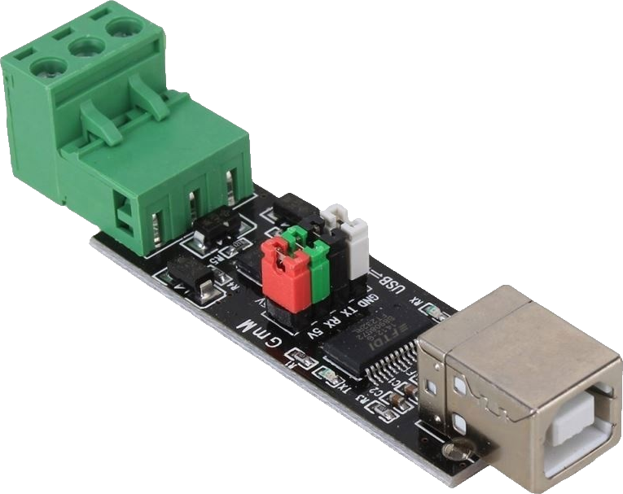
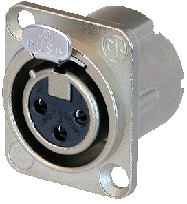

In den letzten Monaten habe ich die einfache Genialität des DMX-Protokolls vollständig zu schätzen gelernt. Es ist schon cool, dass man mit nem einzelen Kabel und einer einzigen Software fast jedes Beleuchtungselement im Umlauf asteuern kann. Allerdings kann dasselbe leider nicht unbedingt über die Hardware gesagt werden. Schnittstellen sind oft teuer und an eine bestimmte Software gebunden. Deshalb hab ich beschlossen, einfach mein eigenes zu bauen.

### Der Plan:
Da das DMX-Protokoll im Wesentlichen dasselbe wie RS485 ist, können wir einfach einen USB-zu-Seriell-Adapter verwenden und ihn mit einem XLR-Anschluss ausstatten.

...

Jap, das ist alles. Wenn man nur ne funktionierende Schnittstelle haben will, kann man die Komponenten einfach miteinander verlöten und fertig. Tatsächlich haben das auch viele Leute so gemacht, wie in [diesem Blog-Beitrag](https://diyprojects.tech/2013/05/diy-usb-dmx-dongle-interface-for-under-10/) zu sehen ist, wo man auch andere coole Gehäuseideen sehen kann.
Ich wollte jedoch, dass meine Schnittstelle mit der kommerziellen Konkurenz mithalten kann, also habe ich auch ein passendes schlankes Gehäuse dafür entworfen.

Also, lass mal ne DMX-Schnittstelle für weniger als 10 € bauen!

### Einkaufsliste:
| Teil | Name| Bild | Kaufen |
| :-: | :-: | :-: | :-: |
| **Platine** | USB to RS485 TTL Serial Converter Adapter FTDI interface FT232RL 75176 Module |  | [Ebay](https://www.ebay.de/itm/273621864836)
| **XLR-Socket** | Neutrik NC3 FD-LX |  | [Thomann](https://www.thomann.de/intl/neutrik_nc3_fd_lx.htm) |
| **Schraubem** (Optional) | 3,5\*16mm Holz Schrauben (\*2)(Kürzere gehen auch) |  | Im Baumarkt |
| **Kabel** | Kabel... |  | |

 

##### Das Gehäuse:
Die Dateien für das Gehäuse sind auf [Github](https://github.com/daveiator/DIY-DMX-Interface-Case) verfügbar. Ich habe mein Gehäuse auf nem Ender 3 Pro 3D-Drucker mit einer Schichtdicke von 0,16 mm gedruckt. Es werden keine Supports benötigt. Wenn man ein transparentes Filament verwendet, kann man auch noch die Aktivitäts-LEDs des Wandlers sehen.

### Zusammenbauen:
Da die Komponenten ansich dieselben sind und die es viel besser erklären, wie man sie zusammenbaut, als ich es je könnte, verweise ich einfach auf den (englischen) [oben genannten Blog](https://diyprojects.tech/2013/05/diy-usb-dmx-dongle-interface-for-under-10/).

Bevor man das Interface ins Gehäuse packt, sollte es wenn möglich getestet werden da man, nachdem es im Gehäuse ist, nur noch schwer an die Komponenten ran kommt.

Trenne das Board und den XLR-Stecker, indem du den grünen Klemmenblock löst. Schieb dann das Board in das Gehäuse, so dass der USB-Connector bündig mit der Wand des Gehäuses abschließt. Das Gehäuse ist so konstruiert, dass es das Board an Ort und Stelle fixiert, nachdem der Klemmenblock mit dem XLR-Connector wieder verbunden ist. Jetzt musst du nur noch den XLR-Connector anschrauben um das Gehäuse verschließen.

Herzlichen Glückwunsch! Damit hast du's geschafft.

### Wie siehts mit Software aus?
Die meiste DMX-Software (die nicht an bestimmte Interfaces gebunden ist) sollte in der Lage sein, sich über den "Enttec Open DMX USB"-Treiber mit diesem Interface zu verbinden. Für eine generischere Lösung habe ich mal ein [kleines Programm](https://crates.io/crates/artnet_to_opendmx) geschrieben welches Art-Net-Befehle in das Interface übersetzt. Dadurch kann man das Interface mit jeder Art-net kompatiblen Software steuern. Installation erfolgt per [cargo](https://doc.rust-lang.org/cargo/getting-started/installation.html):
    
        cargo install artnet_to_opendmx

### Schlußworte:
Danke fürs druchlesen. Ich hoffe dir hat das Projekt was gebracht. Bei Fragen oder Anmerkungen, meld dich bitte.
Ich plan auch noch in Zukunft das Gehäuse als 3D-gedrucktes Kit anzubieten.

### Referenzen:
  * [DIY USB DMX Dongle Interface for under $10](https://diyprojects.tech/2013/05/diy-usb-dmx-dongle-interface-for-under-10/)
  * [Andere Produkte, die denselben Treiber verwenden](https://wiki.openlighting.org/index.php/Products)

*Bilder werden bald hinzugefügt*